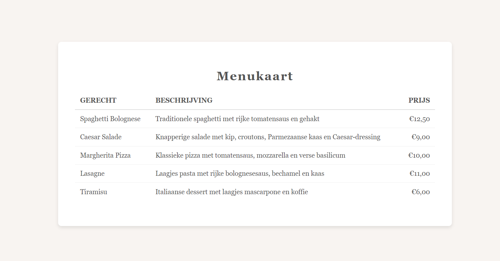

# AltunIT | Tabellen

# Samen aan de slag met HTML-tabellen

In deze oefening gaan we aan de slag met het opbouwen van tabellen in HTML. Tijdens de video en deze opdracht leer je stap voor stap hoe je een tabel maakt met behulp van elementen zoals table, tr, th, en td. Je kunt meedoen door de code zelf in te voeren en de juiste HTML-tags op de juiste plekken te plaatsen, zodat je een overzichtelijke en functionele tabel creëert.

## Wat gaan we doen?

- Stap 1: Begin met de basisstructuur van een tabel door de juiste HTML-tags toe te voegen, zoals table, tr, th, en td.
- Stap 2: Zorg dat elke rij en kolom op de juiste plaats staat en voeg de benodigde tags toe voor een complete tabel.
- Stap 3: Bekijk het resultaat en zie hoe de tabel zich vormt. In het volgende hoofdstuk behandelen we CSS en gaan we dieper in op de styling, maar voor nu ligt de focus op het correct plaatsen van de HTML-tags.

### Hoe kun je meedoen?

1. Clone deze repository naar je lokale omgeving om de oefenopdracht te volgen:
git clone https://github.com/Altun-IT/HTML-Tabellen-Oefenopdracht.git
2. Open het bestand index.html in Visual Studio Code.
3. Volg de video en plaats de HTML-tags op de juiste plaatsen in het bestand om de tabel correct op te bouwen.

### Inhoud van de Tabel
Je zult een tabel bouwen die de volgende onderdelen bevat:
- Table: Gebruik table om de structuur van de tabel te creëren.
- Tr: Gebruik tr voor elke rij in de tabel.
- Th: Gebruik th om de kolomkoppen ‘Gerecht’, ‘Beschrijving’, en ‘Prijs’ aan te geven.
- Td: Gebruik td voor de individuele gegevenscellen, waar je de namen van de gerechten, beschrijvingen, en prijzen invoert.

## Opdrachtomschrijving
Het doel van deze opdracht is om te oefenen met het correct invoegen van HTML-tags op de juiste plekken. De huidige code bevat geen tabelstructuur; jouw taak is om deze structuur toe te voegen met de juiste tags, zodat er een menukaart in tabelvorm ontstaat.

## Eindresultaat
Na het invoegen van de tags zal je een eenvoudige, functionele HTML-tabel hebben die een overzicht geeft van de gerechten, beschrijvingen en prijzen. Hier is een voorbeeld van hoe de tabel eruit kan zien:

### Tips voor Beginners
- Volg de video stap voor stap en pauzeer indien nodig om de structuur van de tabel goed te begrijpen.
- Focus op de juiste tags; styling wordt later behandeld in een apart hoofdstuk over CSS.
- Raadpleeg de HTML-documentatie of bekijk de video opnieuw als je vastloopt.

